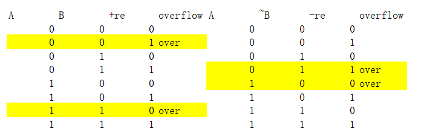

# 计算机组成原理

 2024-2025第二学期 章老师班

一些个人的实验记录和踩过的坑，留给朋友们参考。

## 实验环境配置

本次课程使用docker环境。*（值得一提的是上一年使用的是部署在所里的云平台，今年似乎因为搬迁和一些安全问题只能采用docker本地部署了）*

因为老师的文档给的很详细，这里只简单记录一下步骤。

1. 安装docker desktop  
  注意一定要把c盘留够地方！跟随文档指引直接在官网下载，基本就是一直点next，如果勾选框那里不一样也没事。
2. 导入  
  导入镜像前先在设置勾选`Expose daemon on tcp://localhost:2375 without TLS`，等apply变灰可以点击cancel退回到主界面。之后按部就班就行。
3. 启动  
  在containers页面点击启动的三角按钮，看到前面小圆点变绿说明启动成功，可以在web输入`localhost:3000`打开ide。

注意到实验ide只能下载少量拓展，习惯了本地环境的朋友会不太舒服，一种方案是下载.vsix插件文件导入到docker里安装，使用到以下命令：

```bash
docker exec -it cod-lab /bin/bash
这里随便新建一个文件夹放
$ mkdir /location
$ exit
docker cp example_file cod-lab:/location
```

接着在ide里点击插件右上角，选择“从vsix安装”，选择刚刚导入的文件即可。

另一种方案是在本地ide安装docker插件和dev containers插件，然后配置远程docker环境，这样就可以在本地ide里直接使用docker，打开后在插件页面多了一个下载按钮，**按理说**能下载。但是实际使用中好像没用，目前还未解决。

## 实验0

实验目的就是熟悉一下基本操作。

从远程仓库获取最新的代码

```bash
cd ~/cod-lab && git pull upstream master
```

完成修改后提交

```bash
git add .
git commit
```

以上两步也可以直接在左侧图形化界面点击完成。最后推送到远程仓库

```bash
git push origin master
```

注意gitlab使用的默认主分支是master（而github一般会让你新建一个main分支`git branch -M main`）

## 实验1

实验1需要完成regfile和alu模块基本逻辑。

1. regfile主要完成寄存器堆的读写操作，要求实现同步读异步写，注意对全0`raddr`的判定

另外如果在读操作判断了全0，写操作其实不需要再次判定，因此条件只需要wen

```verilog
	reg [31:0]rf[31:0];

	assign rdata1 = |raddr1 ? rf[raddr1] : 32'b0;
	assign rdata2 = |raddr2 ? rf[raddr2] : 32'b0;
	always @(posedge clk) begin
		if(wen /*& (|waddr)*/) begin
			rf[waddr] <= wdata;
		end
	end
```

2. alu模块主要完成对`and,or,add,sub,slt`五种操作的支持，要求加减法复用同一个加法器

利用补码运算思想，`A-B`可以看作`A+(-B)+1`  
进位在加法过程中计算，而溢出利用真值表  
  
```verilog
	assign cin = op_sub | op_slt;
	assign choice_B = cin ? ~B : B;
	assign and_result = A & B;
	assign or_result = A | B;
	assign {cout, adder_result} = A + choice_B + cin;
	assign add_sub_result = adder_result;
	assign slt_result[31:1] = 31'b0;
	assign slt_result[0]    = (A[31] & ~B[31]) | ((A[31] ~^B[31]) & adder_result[31]);
	assign Zero = ~|Result;
	assign CarryOut = cin ? ~cout : cout;
	assign Overflow = op_add & ~A[31] & ~B[31] &  adder_result[31] |
			              op_add &  A[31] &  B[31] & ~adder_result[31] |
			              op_sub & ~A[31] &  B[31] &  adder_result[31] |
			              op_sub &  A[31] & ~B[31] & ~adder_result[31];
```